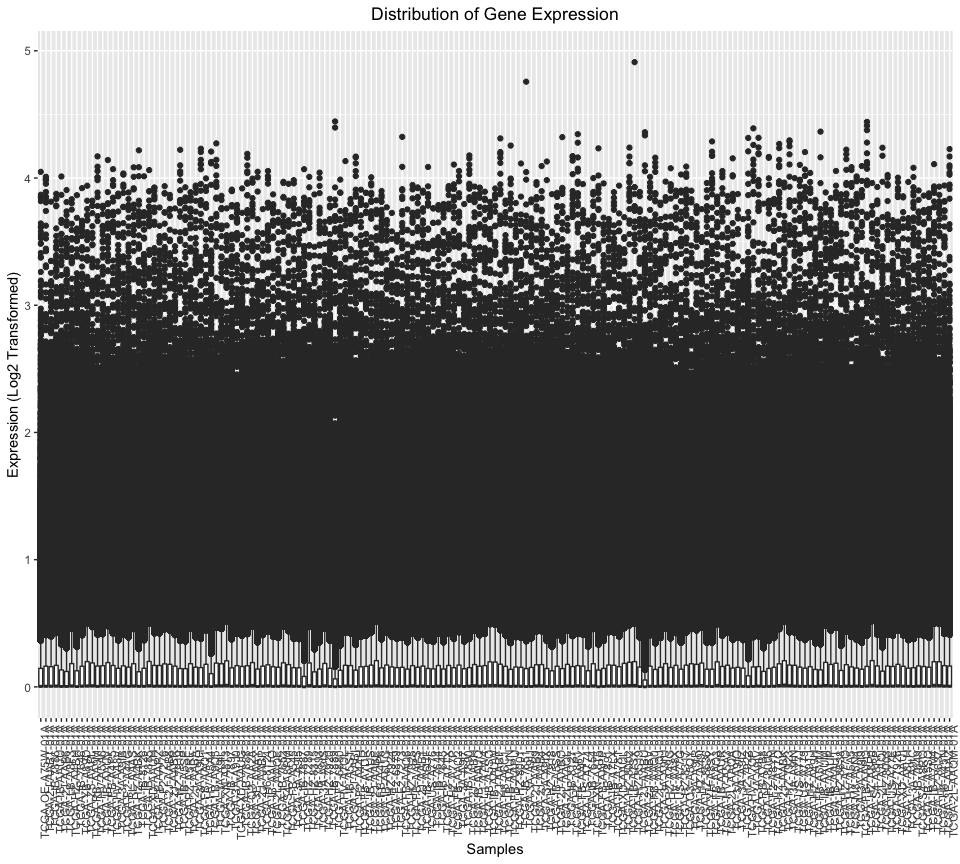
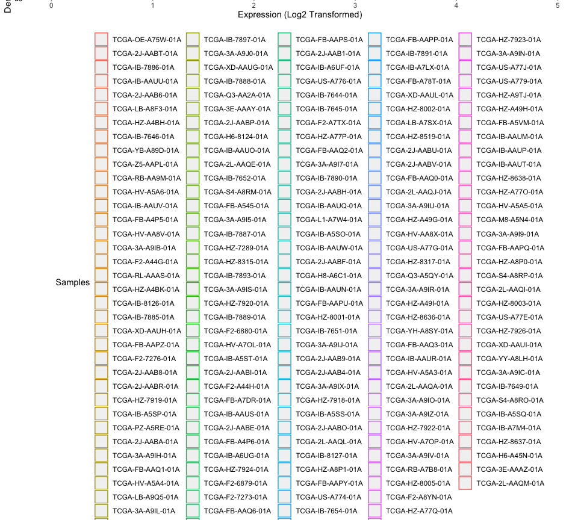

    library(magrittr)
    library(dplyr)

    ## 
    ## Attaching package: 'dplyr'

    ## The following objects are masked from 'package:stats':
    ## 
    ##     filter, lag

    ## The following objects are masked from 'package:base':
    ## 
    ##     intersect, setdiff, setequal, union

    library(tidyverse)

    ## ── Attaching packages ─────────────────────────────────────────────────── tidyverse 1.3.0 ──

    ## ✓ ggplot2 3.2.1     ✓ purrr   0.3.3
    ## ✓ tibble  2.1.3     ✓ stringr 1.4.0
    ## ✓ tidyr   1.0.2     ✓ forcats 0.4.0
    ## ✓ readr   1.3.1

    ## ── Conflicts ────────────────────────────────────────────────────── tidyverse_conflicts() ──
    ## x tidyr::extract()   masks magrittr::extract()
    ## x dplyr::filter()    masks stats::filter()
    ## x dplyr::lag()       masks stats::lag()
    ## x purrr::set_names() masks magrittr::set_names()

    library(ggplot2)
    library(reshape2)

    ## 
    ## Attaching package: 'reshape2'

    ## The following object is masked from 'package:tidyr':
    ## 
    ##     smiths

    library(edgeR)

    ## Warning: package 'edgeR' was built under R version 3.6.1

    ## Loading required package: limma

    library(pheatmap)
    library(ggplot2)

    demo<-read.csv("/Users/simransamra/R/git_temp/Repo_team_Genome-Surfers_W2020/data/raw_data/tcga_paad_clinical.csv")
    load("/Users/simransamra/R/git_temp/Repo_team_Genome-Surfers_W2020/data/raw_data/tcga_paad.RData")

    #Melt data
    tcga$gene <- rownames(tcga)
    dataMelt<-melt(tcga, id.vars = "gene", var = "Samples")

    #Boxplot - Distribution of Gene Expression
    ggplot(dataMelt, aes(x=Samples, y=value)) + 
       geom_boxplot() + 
       xlab("Samples")  + 
      ylab("Expression (Log2 Transformed)")+ 
      theme(axis.text.x = element_text(angle = 90, hjust = 1)) +
      ggtitle("Distribution of Gene Expression")+
      theme(plot.title = element_text(hjust = 0.5))

    #Density Plot
    ggplot(dataMelt, aes(value, color = Samples)) + 
      geom_density() + 
      xlab("Expression (Log2 Transformed)") +
      ylab("Density")+ 
      ggtitle("Distribution of Gene Expression") +
      theme(plot.title = element_text(hjust = 0.5)) + theme(legend.position="bottom")

