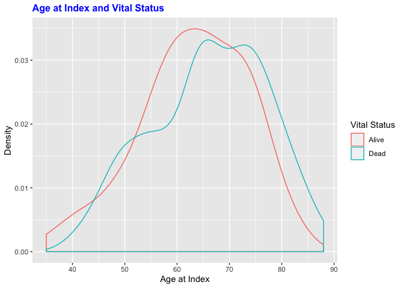
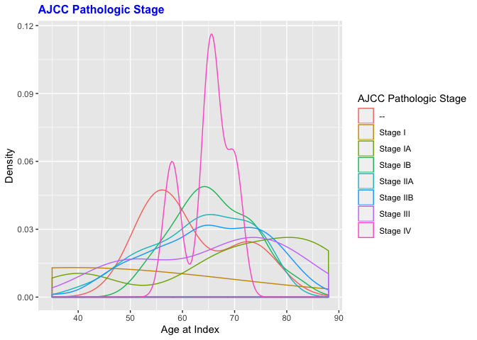

    library(magrittr)
    library(dplyr)

    ## 
    ## Attaching package: 'dplyr'

    ## The following objects are masked from 'package:stats':
    ## 
    ##     filter, lag

    ## The following objects are masked from 'package:base':
    ## 
    ##     intersect, setdiff, setequal, union

    library(tidyverse)

    ## ── Attaching packages ─────────────────────────────────────── tidyverse 1.3.0 ──

    ## ✓ ggplot2 3.2.1     ✓ purrr   0.3.3
    ## ✓ tibble  2.1.3     ✓ stringr 1.4.0
    ## ✓ tidyr   1.0.2     ✓ forcats 0.4.0
    ## ✓ readr   1.3.1

    ## ── Conflicts ────────────────────────────────────────── tidyverse_conflicts() ──
    ## x tidyr::extract()   masks magrittr::extract()
    ## x dplyr::filter()    masks stats::filter()
    ## x dplyr::lag()       masks stats::lag()
    ## x purrr::set_names() masks magrittr::set_names()

    library(ggplot2)
    library(reshape2)

    ## 
    ## Attaching package: 'reshape2'

    ## The following object is masked from 'package:tidyr':
    ## 
    ##     smiths

    library(edgeR)

    ## Warning: package 'edgeR' was built under R version 3.6.1

    ## Loading required package: limma

    library(pheatmap)
    library(ggplot2)

    demo<-read.csv("/Users/simransamra/R/git_temp/Repo_team_Genome-Surfers_W2020/data/raw_data/tcga_paad_clinical.csv", header = T)
    load("/Users/simransamra/R/git_temp/Repo_team_Genome-Surfers_W2020/data/raw_data/tcga_paad.RData")

    #Melt data
    tcga$gene <- rownames(tcga)
    dataMelt<-melt(tcga, id.vars = "gene", var = "Samples")

    #Set up data
    demo <- demo %>% select(c(submitter_id, age_at_index,year_of_birth, year_of_death, vital_status, race, gender, ajcc_pathologic_m, ajcc_pathologic_n,ajcc_pathologic_t, ajcc_pathologic_stage))

    tcgaT <- as.data.frame(t(as.matrix(tcga)))
    tcgaN <- tibble::rownames_to_column(tcgaT, "submitter_id")

    demo$submitter_id <- as.factor(demo$submitter_id)
    data <- right_join(x = tcgaN, y = demo, by = "submitter_id")

    ## Warning: Column `submitter_id` joining character vector and factor, coercing
    ## into character vector

    ggplot(data, aes(x = age_at_index)) + 
    geom_density(aes(fill = vital_status), alpha = 0.5) +
    xlab("Age at Index")  + 
    ylab("Density") +
    labs(fill='Vital Status') +
    scale_fill_manual(values = c("darkblue", "darkred"))

    ggplot(data, aes(x = age_at_index)) + 
    geom_density(aes(fill = ajcc_pathologic_m), alpha = 0.5) +
    xlab("Age at Index")  + 
    ylab("Density") +
    labs(fill='AJCC Pathologic M') 

    #Boxplot - Distribution of Gene Expression
    ggplot(dataMelt, aes(x=Samples, y=value)) + 
       geom_boxplot() + 
       xlab("Samples")  + 
      ylab("Expression (Log2 Transformed)")+ 
      theme(axis.text.x = element_text(angle = 90, hjust = 1)) +
      ggtitle("Distribution of Gene Expression")+
      theme(plot.title = element_text(hjust = 0.5))

    #Density Plot
    ggplot(dataMelt, aes(value, color = Samples)) + 
      geom_density() + 
      xlab("Expression (Log2 Transformed)") +
      ylab("Density")+ 
      ggtitle("Distribution of Gene Expression") +
      theme(plot.title = element_text(hjust = 0.5)) + theme(legend.position="none")

    #Prepare Data
    load("/Users/simransamra/R/git_temp/Repo_team_Genome-Surfers_W2020/data/raw_data/tcga_paad.RData")
    #tcga$gene <- rownames(tcga)
    demoHeat<-demo
    toDelete <- seq(1, nrow(demoHeat), 2)
    demoHeat<-demoHeat[toDelete ,]

    designFactors <- as.data.frame(demoHeat[, c("ajcc_pathologic_m",  "ajcc_pathologic_n", "ajcc_pathologic_t", "ajcc_pathologic_stage")])

    rownames(designFactors) <- colnames(tcga)
    data.matrix <- cor(tcga)
    pheatmap(data.matrix, cluster_rows = T, scale = "none", clustering_method = "average", 
        clustering_distance_cols = "correlation", show_colnames = T, show_rownames = T, 
        main = "Clustering heatmap", annotation = designFactors, treeheight_col = 35, treeheight_row = 35,
        fontsize = 10)

