Simran
================
Simran
05/03/2020

\#\#Loading Libraries

``` r
library(magrittr)
library(dplyr)
```

    ## 
    ## Attaching package: 'dplyr'

    ## The following objects are masked from 'package:stats':
    ## 
    ##     filter, lag

    ## The following objects are masked from 'package:base':
    ## 
    ##     intersect, setdiff, setequal, union

``` r
library(tidyverse)
```

    ## ── Attaching packages ──────────────────── tidyverse 1.3.0 ──

    ## ✓ ggplot2 3.3.0     ✓ purrr   0.3.3
    ## ✓ tibble  2.1.3     ✓ stringr 1.4.0
    ## ✓ tidyr   1.0.2     ✓ forcats 0.4.0
    ## ✓ readr   1.3.1

    ## ── Conflicts ─────────────────────── tidyverse_conflicts() ──
    ## x tidyr::extract()   masks magrittr::extract()
    ## x dplyr::filter()    masks stats::filter()
    ## x dplyr::lag()       masks stats::lag()
    ## x purrr::set_names() masks magrittr::set_names()

``` r
library(ggplot2)
library(reshape2)
```

    ## 
    ## Attaching package: 'reshape2'

    ## The following object is masked from 'package:tidyr':
    ## 
    ##     smiths

``` r
# if (!requireNamespace("BiocManager", quietly = TRUE))
#     install.packages("BiocManager")
# 
# BiocManager::install("edgeR")
library(edgeR)
```

    ## Warning: package 'edgeR' was built under R version 3.6.2

    ## Loading required package: limma

``` r
library(pheatmap)
library(ggplot2)

# library(devtools)
# install_github("vqv/ggbiplot")
library(ggbiplot)
```

    ## Loading required package: plyr

    ## ------------------------------------------------------------------------------

    ## You have loaded plyr after dplyr - this is likely to cause problems.
    ## If you need functions from both plyr and dplyr, please load plyr first, then dplyr:
    ## library(plyr); library(dplyr)

    ## ------------------------------------------------------------------------------

    ## 
    ## Attaching package: 'plyr'

    ## The following object is masked from 'package:purrr':
    ## 
    ##     compact

    ## The following objects are masked from 'package:dplyr':
    ## 
    ##     arrange, count, desc, failwith, id, mutate, rename, summarise,
    ##     summarize

    ## Loading required package: scales

    ## 
    ## Attaching package: 'scales'

    ## The following object is masked from 'package:purrr':
    ## 
    ##     discard

    ## The following object is masked from 'package:readr':
    ## 
    ##     col_factor

    ## Loading required package: grid

``` r
library(ggpubr)
```

    ## 
    ## Attaching package: 'ggpubr'

    ## The following object is masked from 'package:plyr':
    ## 
    ##     mutate

``` r
suppressPackageStartupMessages(library(reshape2))
suppressPackageStartupMessages(library(tidyverse))
suppressPackageStartupMessages(library(pheatmap))
```

\#Read in Data and Prepare Data
Frame

``` r
demo<-read.csv("~/Desktop/git_docs/Repo_team_Genome-Surfers_W2020/data/raw_data/tcga_paad_clinical.csv", header = T)
load("~/Desktop/git_docs/Repo_team_Genome-Surfers_W2020/data/raw_data/tcga_paad.RData")

#Melt data
tcga$gene <- rownames(tcga)
dataMelt<-melt(tcga, id.vars = "gene", var = "Samples")

#Set up data
demo <- demo %>% select(c(submitter_id, age_at_index,year_of_birth, year_of_death, vital_status, race, gender, ajcc_pathologic_m, ajcc_pathologic_n,ajcc_pathologic_t, ajcc_pathologic_stage))

tcgaT <- as.data.frame(t(as.matrix(tcga)))
tcgaN <- tibble::rownames_to_column(tcgaT, "submitter_id")

demo$submitter_id <- as.factor(demo$submitter_id)
data <- right_join(x = tcgaN, y = demo, by = "submitter_id")
```

    ## Warning: Column `submitter_id` joining character vector and factor, coercing
    ## into character vector

\#Density Plot - Age at Index vs Vital Status

``` r
ggplot(data, aes(x = age_at_index, colour=vital_status)) + 
geom_density() +
labs(title = "Age at Index and Vital Status",
color = "Vital Status", x = "Age at Index", y = "Density") +
theme(
plot.title = element_text(color = "blue", size = 12, face = "bold")) +
scale_fill_manual(values = c("darkblue", "darkred"))
```

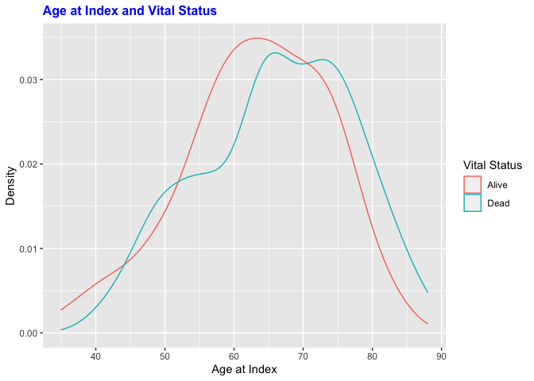<!-- --> \#Density Plot -
Age at Index vs Pathologic Stage M

``` r
ggplot(data, aes(x = age_at_index, colour=ajcc_pathologic_m)) + 
geom_density() +
labs(title = "AJCC Pathologic M",
subtitle = "AJCC TNM system: (M) Classifies cancers by the presence or absence of distant metastases",  x = "Age at Index", y = "Density", color = "AJCC Pathologic M", caption = "M0:No evidence of distant metastasis; M1: Distant metastasis; MX: Unknown distant metastasis status") +
theme(
plot.title = element_text(color = "blue", size = 12, face = "bold"),
plot.subtitle = element_text(color = "black", size = 7),
plot.caption = element_text(color = "black", size = 6, hjust = 0)
)
```

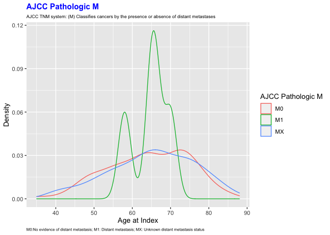<!-- -->

\#Density Plot - Age at Index vs Pathologic Stage N

``` r
ggplot(data, aes(x = age_at_index, colour=ajcc_pathologic_n)) + 
geom_density() +
labs(title = "AJCC Pathologic N",
subtitle = "AJCC TNM system: (N) Describes involvement of regional lymph nodes",  x = "Age at Index", y = "Density", color = "AJCC Pathologic N", caption = "--: Not reported; N0: No regional lymph node metastasis; N1: Regional lymph node metastasis; \n  N1b: Metastasis in multiple regional lymph nodes; NX: Metastasis cannot be assessed") +
theme(
plot.title = element_text(color = "blue", size = 12, face = "bold"),
plot.subtitle = element_text(color = "black", size = 7),
plot.caption = element_text(color = "black", size = 6, hjust = 0)
)
```

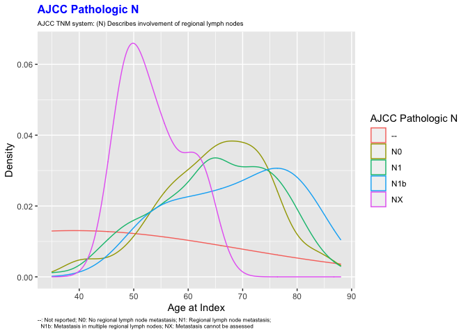<!-- -->

\#Density Plot - Age at Index vs Pathologic Stage T

``` r
ggplot(data, aes(x = age_at_index, colour=ajcc_pathologic_t)) + 
geom_density() +
labs(title = "AJCC Pathologic T",
subtitle = "AJCC TNM system: (T) ",  x = "Age at Index", y = "Density", color = "AJCC Pathologic T", caption = "--: Not reported; T1: Tumor limited to the pancreas (2 cm or less in greatest dimension); T2: Tumor limited to \n the pancreas (greater than 2 cm in greatest dimension); T3: Tumor extends beyond pancrease, but without \n the involvement of coeliac axis or superior mesenteric artery; T4: Tumor involves coeliac axis or superior \n mesenteric artery; TX: Tumor cannot be assessed )


") +
theme(
plot.title = element_text(color = "blue", size = 12, face = "bold"),
plot.subtitle = element_text(color = "black", size = 7),
plot.caption = element_text(color = "black", size = 6, hjust = 0)
)
```

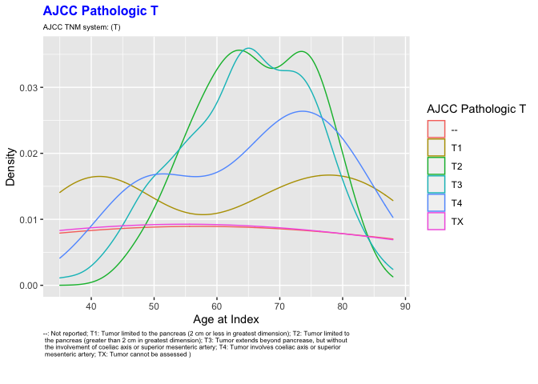<!-- --> 


\#Density Plot - Age at Index vs Pathologic Stage

``` r
ggplot(data, aes(x = age_at_index, colour=ajcc_pathologic_stage)) + 
geom_density() +
labs(title = "AJCC Pathologic Stage",  x = "Age at Index", y = "Density", color = "AJCC Pathologic Stage") +
theme(
plot.title = element_text(color = "blue", size = 12, face = "bold"),
plot.subtitle = element_text(color = "black", size = 7),
plot.caption = element_text(color = "black", size = 6, hjust = 0)
)
```

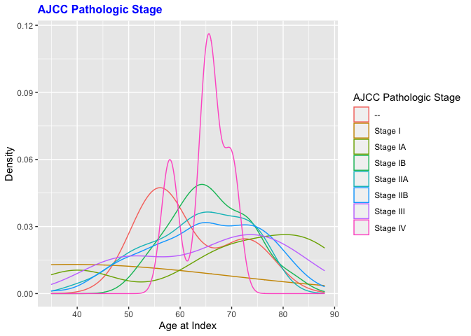<!-- -->

\#Boxplot - Distribution of Gene Expression

``` r
#Boxplot - Distribution of Gene Expression
ggplot(dataMelt, aes(x=Samples, y=value)) + 
   geom_boxplot() + 
   xlab("Samples")  + 
  ylab("Expression (Log_2_ Transformed)")+ 
  theme(axis.text.x = element_text(angle = 90, hjust = 1)) +
  ggtitle("Distribution of Gene Expression Across All 177 Samples")+
  theme(plot.title = element_text(hjust = 0.5))
```

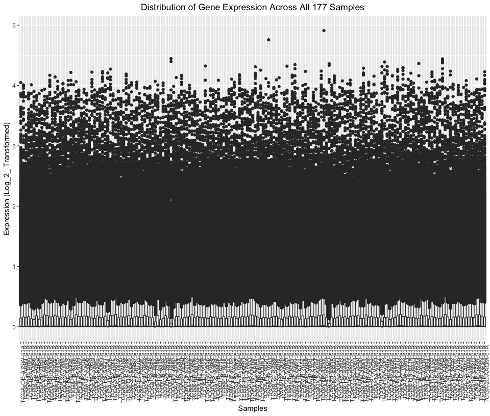<!-- --> \#Density Plot

``` r
#Density Plot
ggplot(dataMelt, aes(value, color = Samples)) + 
  geom_density() + 
  xlab("Expression (Log2 Transformed)") +
  ylab("Density")+ 
  ggtitle("Distribution of Gene Expression Across All 177 Samples") +
  theme(plot.title = element_text(hjust = 0.5)) + theme(legend.position="none")
```

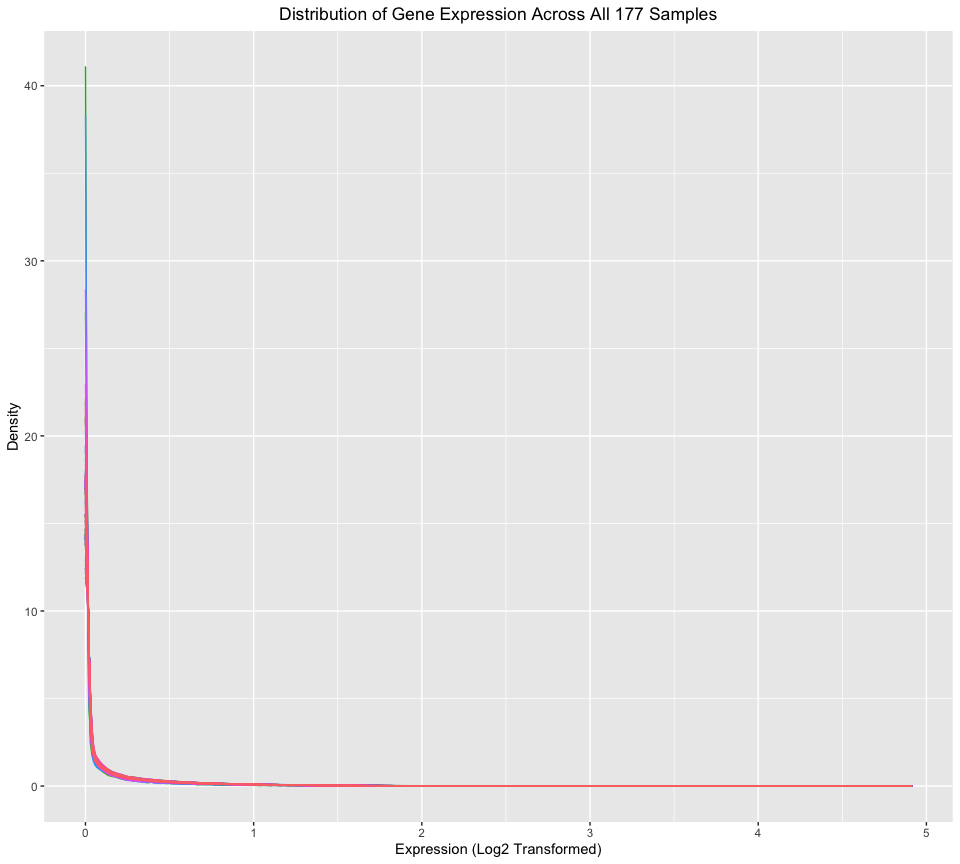<!-- -->

\#Heatmaps: Show Correlation

``` r
#Prepare Data
load("~/Desktop/git_docs/Repo_team_Genome-Surfers_W2020/data/raw_data/tcga_paad.RData")
#tcga$gene <- rownames(tcga)
demoHeat<-demo
toDelete <- seq(1, nrow(demoHeat), 2)
demoHeat<-demoHeat[toDelete ,]

designFactors <- as.data.frame(demoHeat[, c("ajcc_pathologic_stage", "vital_status")])

rownames(designFactors) <- colnames(tcga)
data.matrix <- cor(tcga)
pheatmap(data.matrix, cluster_rows = T, scale = "none", clustering_method = "average", 
    clustering_distance_cols = "correlation", show_colnames = T, show_rownames = T, 
    main = "Clustering Heatmap: Pathologic Stage and Vital Status ", annotation = designFactors, treeheight_col = 35, treeheight_row = 35,
    fontsize = 3)
```

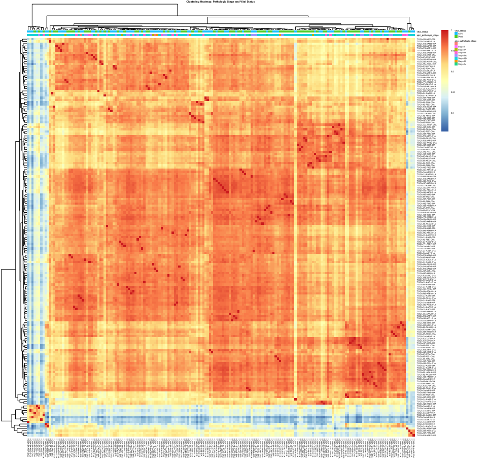<!-- -->

``` r
#Prepare Data
load("~/Desktop/git_docs/Repo_team_Genome-Surfers_W2020/data/raw_data/tcga_paad.RData")
#tcga$gene <- rownames(tcga)
demoHeat<-demo
toDelete <- seq(1, nrow(demoHeat), 2)
demoHeat<-demoHeat[toDelete ,]

designFactors <- as.data.frame(demoHeat[, c("race",  "gender")])

rownames(designFactors) <- colnames(tcga)
data.matrix <- cor(tcga)
pheatmap(data.matrix, cluster_rows = T, scale = "none", clustering_method = "average", 
    clustering_distance_cols = "correlation", show_colnames = T, show_rownames = T, 
    main = "Clustering Heatmap: Gender and Race", annotation = designFactors, treeheight_col = 35, treeheight_row = 35,
    fontsize = 3)
```

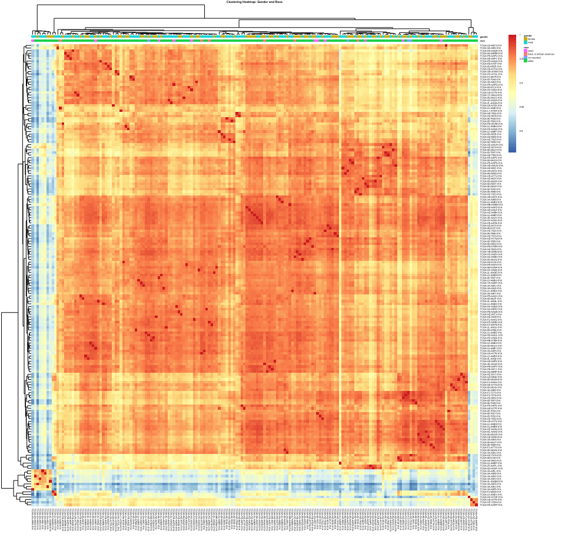<!-- -->

``` r
#Prepare Data
load("~/Desktop/git_docs/Repo_team_Genome-Surfers_W2020/data/raw_data/tcga_paad.RData")
#tcga$gene <- rownames(tcga)
demoHeat<-demo
toDelete <- seq(1, nrow(demoHeat), 2)
demoHeat<-demoHeat[toDelete ,]

designFactors <- as.data.frame(demoHeat[, c("ajcc_pathologic_n", "ajcc_pathologic_t", "ajcc_pathologic_m")])

rownames(designFactors) <- colnames(tcga)
data.matrix <- cor(tcga)
pheatmap(data.matrix, cluster_rows = T, scale = "none", clustering_method = "average", 
    clustering_distance_cols = "correlation", show_colnames = T, show_rownames = T, 
    main = "Clustering Heatmap: AJCC TNM System", annotation = designFactors, treeheight_col = 35, treeheight_row = 35,
    fontsize = 3)
```

<!-- -->

``` r
tcgaT<-t(tcga)
tcga.pca <- prcomp(tcgaT, center = TRUE)
summary(tcga.pca)
```

    ## Importance of components:
    ##                           PC1    PC2    PC3     PC4     PC5     PC6    PC7
    ## Standard deviation     7.5906 7.4610 6.2529 4.86404 4.46313 4.11191 3.2606
    ## Proportion of Variance 0.1376 0.1330 0.0934 0.05652 0.04758 0.04039 0.0254
    ## Cumulative Proportion  0.1376 0.2706 0.3640 0.42053 0.46811 0.50850 0.5339
    ##                            PC8     PC9    PC10    PC11    PC12    PC13    PC14
    ## Standard deviation     3.23307 2.66589 2.65305 2.40256 2.37936 2.27504 2.13855
    ## Proportion of Variance 0.02497 0.01698 0.01681 0.01379 0.01352 0.01236 0.01092
    ## Cumulative Proportion  0.55887 0.57584 0.59266 0.60645 0.61997 0.63233 0.64326
    ##                           PC15    PC16    PC17    PC18    PC19    PC20    PC21
    ## Standard deviation     2.03944 1.99613 1.94578 1.88896 1.84567 1.75546 1.74472
    ## Proportion of Variance 0.00994 0.00952 0.00904 0.00852 0.00814 0.00736 0.00727
    ## Cumulative Proportion  0.65319 0.66271 0.67176 0.68028 0.68842 0.69578 0.70305
    ##                           PC22    PC23    PC24    PC25   PC26    PC27   PC28
    ## Standard deviation     1.70065 1.61549 1.59193 1.57297 1.5446 1.48388 1.4753
    ## Proportion of Variance 0.00691 0.00623 0.00605 0.00591 0.0057 0.00526 0.0052
    ## Cumulative Proportion  0.70996 0.71619 0.72225 0.72816 0.7339 0.73912 0.7443
    ##                           PC29    PC30    PC31    PC32    PC33    PC34    PC35
    ## Standard deviation     1.45221 1.43746 1.40615 1.38932 1.36818 1.34369 1.32985
    ## Proportion of Variance 0.00504 0.00494 0.00472 0.00461 0.00447 0.00431 0.00422
    ## Cumulative Proportion  0.74935 0.75429 0.75901 0.76362 0.76810 0.77241 0.77663
    ##                           PC36   PC37    PC38    PC39    PC40    PC41    PC42
    ## Standard deviation     1.31221 1.2937 1.27397 1.25732 1.25202 1.23219 1.22025
    ## Proportion of Variance 0.00411 0.0040 0.00388 0.00378 0.00374 0.00363 0.00356
    ## Cumulative Proportion  0.78075 0.7847 0.78862 0.79240 0.79614 0.79977 0.80333
    ##                           PC43    PC44   PC45    PC46    PC47    PC48    PC49
    ## Standard deviation     1.20476 1.19661 1.1929 1.17625 1.16008 1.14263 1.14034
    ## Proportion of Variance 0.00347 0.00342 0.0034 0.00331 0.00321 0.00312 0.00311
    ## Cumulative Proportion  0.80679 0.81021 0.8136 0.81692 0.82013 0.82325 0.82636
    ##                           PC50    PC51    PC52    PC53   PC54    PC55    PC56
    ## Standard deviation     1.12769 1.12215 1.10669 1.09724 1.0834 1.07069 1.06702
    ## Proportion of Variance 0.00304 0.00301 0.00293 0.00288 0.0028 0.00274 0.00272
    ## Cumulative Proportion  0.82940 0.83240 0.83533 0.83821 0.8410 0.84375 0.84647
    ##                           PC57    PC58    PC59    PC60    PC61    PC62    PC63
    ## Standard deviation     1.05512 1.04918 1.03340 1.01957 1.00841 0.99769 0.99255
    ## Proportion of Variance 0.00266 0.00263 0.00255 0.00248 0.00243 0.00238 0.00235
    ## Cumulative Proportion  0.84913 0.85176 0.85431 0.85679 0.85922 0.86160 0.86395
    ##                           PC64    PC65    PC66    PC67    PC68    PC69    PC70
    ## Standard deviation     0.97970 0.97378 0.96766 0.95341 0.95272 0.94468 0.93960
    ## Proportion of Variance 0.00229 0.00227 0.00224 0.00217 0.00217 0.00213 0.00211
    ## Cumulative Proportion  0.86624 0.86851 0.87075 0.87292 0.87509 0.87722 0.87933
    ##                           PC71    PC72    PC73   PC74    PC75    PC76    PC77
    ## Standard deviation     0.93296 0.92647 0.92585 0.9160 0.90319 0.89812 0.88882
    ## Proportion of Variance 0.00208 0.00205 0.00205 0.0020 0.00195 0.00193 0.00189
    ## Cumulative Proportion  0.88141 0.88346 0.88550 0.8875 0.88946 0.89138 0.89327
    ##                           PC78    PC79    PC80    PC81    PC82    PC83    PC84
    ## Standard deviation     0.88479 0.87601 0.87163 0.86513 0.85762 0.85084 0.84765
    ## Proportion of Variance 0.00187 0.00183 0.00181 0.00179 0.00176 0.00173 0.00172
    ## Cumulative Proportion  0.89514 0.89697 0.89879 0.90058 0.90233 0.90406 0.90578
    ##                           PC85    PC86    PC87    PC88    PC89    PC90    PC91
    ## Standard deviation     0.84132 0.83277 0.82569 0.82210 0.82080 0.81245 0.80549
    ## Proportion of Variance 0.00169 0.00166 0.00163 0.00161 0.00161 0.00158 0.00155
    ## Cumulative Proportion  0.90747 0.90913 0.91076 0.91237 0.91398 0.91556 0.91711
    ##                           PC92    PC93    PC94   PC95    PC96    PC97    PC98
    ## Standard deviation     0.80186 0.79948 0.79645 0.7915 0.78182 0.77279 0.76916
    ## Proportion of Variance 0.00154 0.00153 0.00152 0.0015 0.00146 0.00143 0.00141
    ## Cumulative Proportion  0.91864 0.92017 0.92169 0.9232 0.92464 0.92607 0.92748
    ##                           PC99   PC100   PC101   PC102   PC103   PC104   PC105
    ## Standard deviation     0.76758 0.76277 0.75910 0.75578 0.75163 0.74820 0.74532
    ## Proportion of Variance 0.00141 0.00139 0.00138 0.00136 0.00135 0.00134 0.00133
    ## Cumulative Proportion  0.92889 0.93028 0.93166 0.93302 0.93437 0.93571 0.93703
    ##                          PC106   PC107   PC108   PC109   PC110   PC111   PC112
    ## Standard deviation     0.74211 0.73388 0.73367 0.72617 0.71914 0.71562 0.71149
    ## Proportion of Variance 0.00132 0.00129 0.00129 0.00126 0.00124 0.00122 0.00121
    ## Cumulative Proportion  0.93835 0.93964 0.94092 0.94218 0.94342 0.94464 0.94585
    ##                         PC113   PC114   PC115   PC116   PC117   PC118   PC119
    ## Standard deviation     0.7093 0.70143 0.69659 0.69572 0.69245 0.69013 0.68343
    ## Proportion of Variance 0.0012 0.00118 0.00116 0.00116 0.00115 0.00114 0.00112
    ## Cumulative Proportion  0.9470 0.94823 0.94939 0.95054 0.95169 0.95283 0.95394
    ##                         PC120   PC121   PC122   PC123   PC124   PC125   PC126
    ## Standard deviation     0.6787 0.67516 0.67369 0.67091 0.66749 0.66510 0.66058
    ## Proportion of Variance 0.0011 0.00109 0.00108 0.00108 0.00106 0.00106 0.00104
    ## Cumulative Proportion  0.9550 0.95613 0.95721 0.95829 0.95935 0.96041 0.96145
    ##                          PC127   PC128  PC129   PC130   PC131   PC132   PC133
    ## Standard deviation     0.65136 0.64932 0.6462 0.64365 0.63658 0.63520 0.63047
    ## Proportion of Variance 0.00101 0.00101 0.0010 0.00099 0.00097 0.00096 0.00095
    ## Cumulative Proportion  0.96247 0.96347 0.9645 0.96546 0.96643 0.96739 0.96834
    ##                          PC134   PC135   PC136   PC137   PC138  PC139   PC140
    ## Standard deviation     0.62624 0.62368 0.62138 0.61827 0.61653 0.6152 0.60949
    ## Proportion of Variance 0.00094 0.00093 0.00092 0.00091 0.00091 0.0009 0.00089
    ## Cumulative Proportion  0.96928 0.97021 0.97113 0.97204 0.97295 0.9739 0.97474
    ##                          PC141   PC142   PC143   PC144   PC145   PC146   PC147
    ## Standard deviation     0.60762 0.60520 0.59790 0.59652 0.58800 0.58758 0.58335
    ## Proportion of Variance 0.00088 0.00087 0.00085 0.00085 0.00083 0.00082 0.00081
    ## Cumulative Proportion  0.97562 0.97650 0.97735 0.97820 0.97903 0.97985 0.98067
    ##                          PC148   PC149   PC150   PC151   PC152   PC153   PC154
    ## Standard deviation     0.58192 0.57633 0.57534 0.57039 0.56453 0.55945 0.55876
    ## Proportion of Variance 0.00081 0.00079 0.00079 0.00078 0.00076 0.00075 0.00075
    ## Cumulative Proportion  0.98148 0.98227 0.98306 0.98384 0.98460 0.98535 0.98609
    ##                          PC155   PC156   PC157   PC158  PC159   PC160   PC161
    ## Standard deviation     0.55634 0.55003 0.54940 0.54532 0.5422 0.53841 0.53744
    ## Proportion of Variance 0.00074 0.00072 0.00072 0.00071 0.0007 0.00069 0.00069
    ## Cumulative Proportion  0.98683 0.98755 0.98828 0.98899 0.9897 0.99038 0.99107
    ##                          PC162   PC163   PC164   PC165   PC166   PC167   PC168
    ## Standard deviation     0.53566 0.52821 0.52474 0.52011 0.51474 0.51070 0.50689
    ## Proportion of Variance 0.00069 0.00067 0.00066 0.00065 0.00063 0.00062 0.00061
    ## Cumulative Proportion  0.99176 0.99242 0.99308 0.99373 0.99436 0.99498 0.99560
    ##                         PC169   PC170   PC171   PC172   PC173   PC174   PC175
    ## Standard deviation     0.5007 0.49704 0.49319 0.48546 0.47300 0.47136 0.46727
    ## Proportion of Variance 0.0006 0.00059 0.00058 0.00056 0.00053 0.00053 0.00052
    ## Cumulative Proportion  0.9962 0.99679 0.99737 0.99793 0.99846 0.99899 0.99952
    ##                          PC176     PC177
    ## Standard deviation     0.45009 1.669e-14
    ## Proportion of Variance 0.00048 0.000e+00
    ## Cumulative Proportion  1.00000 1.000e+00

``` r
#PCA - Gender
a<-ggbiplot(tcga.pca , var.axes = FALSE, groups=demoHeat$gender)
a + labs(title = "Gender") 
```

<!-- -->

``` r
#PCA - Race
b<-ggbiplot(tcga.pca , var.axes = FALSE, groups=demoHeat$race)
b + labs(title = "Race") 
```

<!-- -->

``` r
#PCA - Vital Status
c<-ggbiplot(tcga.pca , var.axes = FALSE, groups=demoHeat$vital_status)
c + labs(title = "Vital Staus") 
```

<!-- -->

``` r
#PCA - AJCC Pathologic M
d<-ggbiplot(tcga.pca , var.axes = FALSE, groups=demoHeat$ajcc_pathologic_m)
d + labs(title = "AJCC Pathologic M") 
```

<!-- -->

``` r
#PCA - AJCC Pathologic N
e<-ggbiplot(tcga.pca , var.axes = FALSE, groups=demoHeat$ajcc_pathologic_n)
e + labs(title = "AJCC Pathologic N") 
```

<!-- -->

``` r
#PCA - AJCC Pathologic T
f<-ggbiplot(tcga.pca , var.axes = FALSE, groups=demoHeat$ajcc_pathologic_t)
f + labs(title = "AJCC Pathologic T") 
```

<!-- -->

``` r
#PCA - AJCC Pathologic Stage
g<-ggbiplot(tcga.pca , var.axes = FALSE, groups=demoHeat$ajcc_pathologic_stage)
g + labs(title = "AJCC Pathologic Stage") 
```

<!-- -->

``` r
#Multiple PCA plots 
ggarrange(a, b, c, ncol = 2, nrow = 2)
```

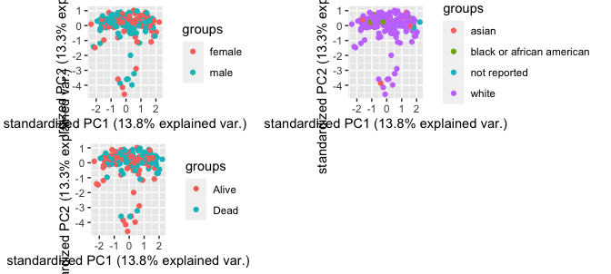<!-- -->

``` r
ggarrange(d,e,f,g, ncol = 2, nrow = 2)
```

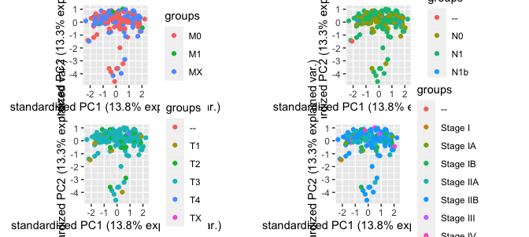<!-- -->
