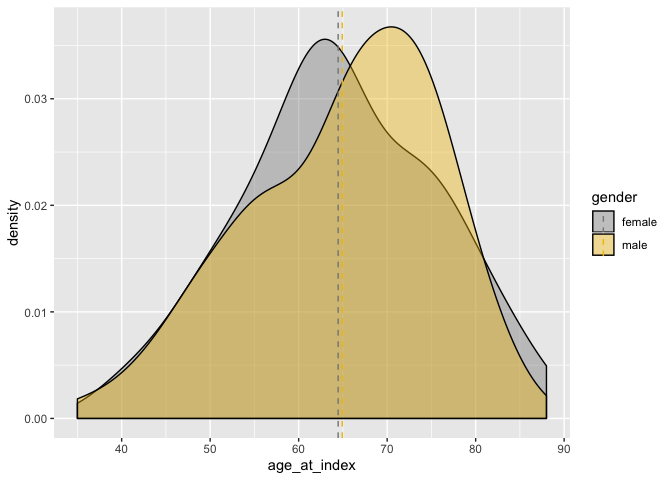
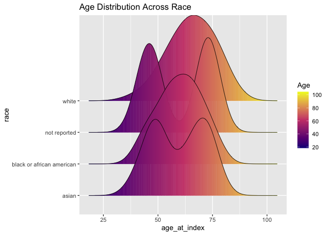

code
================

``` r
suppressPackageStartupMessages(library(tidyr))
suppressPackageStartupMessages(library(ggplot2))
suppressPackageStartupMessages(library(survival))
suppressPackageStartupMessages(library(dplyr))
suppressPackageStartupMessages(library(stringr))
suppressPackageStartupMessages(library(ggpubr))
suppressPackageStartupMessages(library(ggridges))
```

# Data Wrangling:

``` r
cli <- read.csv("~/Desktop/git_docs/Repo_team_Genome-Surfers_W2020/data/raw_data/tcga_paad_clinical.csv", header = T)
cli1 <- cli %>% select(c(submitter_id, age_at_index, 
                         year_of_birth, year_of_death, vital_status, 
                         race, gender, ajcc_pathologic_m, ajcc_pathologic_n, 
                         ajcc_pathologic_t, ajcc_pathologic_stage))

load("~/Desktop/git_docs/Repo_team_Genome-Surfers_W2020/data/raw_data/tcga_paad.RData")

names(tcga) <- substr(names(tcga), 1, 12)
t <- as.data.frame(t(as.matrix(tcga)))
tcga1 <- tibble::rownames_to_column(t, "submitter_id")

cli1$submitter_id <- as.factor(cli1$submitter_id)

dat <- right_join(x = tcga1, y = cli1, by = "submitter_id")
```

    ## Warning: Column `submitter_id` joining character vector and factor, coercing
    ## into character vector

# EDA:

\#\#Age distribution across gender

``` r
mu <- dat %>% 
  group_by(gender) %>%
  summarise(grp.mean = mean(age_at_index))

ggplot(dat, aes(x = age_at_index))+ 
  geom_density(aes(fill = gender), alpha = 0.4) +
      geom_vline(aes(xintercept = grp.mean, color = gender),
             data = mu, linetype = "dashed") +
  scale_color_manual(values = c("#868686FF", "#EFC000FF"))+
  scale_fill_manual(values = c("#868686FF", "#EFC000FF"))
```

<!-- -->

\#\#Age distribution across race

``` r
ggplot(
  dat, 
  aes(x = age_at_index, y = race)
  ) +
  geom_density_ridges_gradient(
    aes(fill = ..x..), scale = 3, size = 0.3
    ) +
  scale_fill_gradientn(
    colours = c("#0D0887FF", "#CC4678FF", "#F0F921FF"),
    name = "Age"
    )+
  labs(title = 'Age Distribution Across Race') 
```

    ## Picking joint bandwidth of 5.56

<!-- -->
