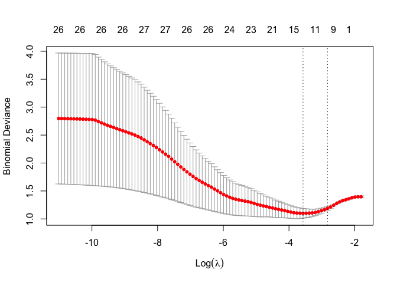
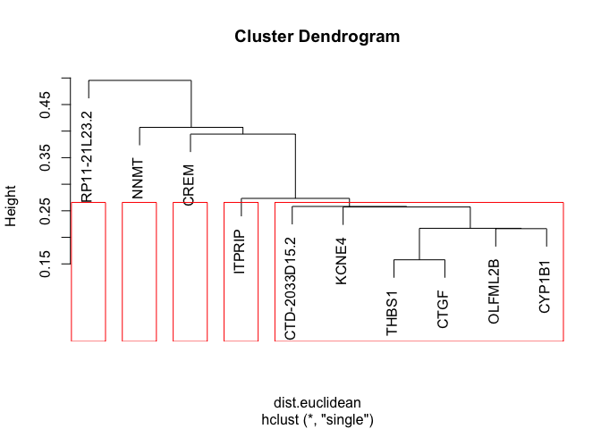

code
================

``` r
suppressPackageStartupMessages(library(tidyverse))
suppressPackageStartupMessages(library(reshape2))
suppressPackageStartupMessages(library(survival))
suppressPackageStartupMessages(library(stringr))
suppressPackageStartupMessages(library(ggpubr))
suppressPackageStartupMessages(library(ggridges))
suppressPackageStartupMessages(library(glmnet))
suppressPackageStartupMessages(library(limma))
```

# Data Wrangling:

``` r
cli <- read.csv("~/Desktop/git_docs/Repo_team_Genome-Surfers_W2020/data/raw_data/tcga_paad_clinical.csv", header = T)
toDelete <- seq(0, nrow(cli), 2)
cli <-  cli[-toDelete, ]
cli1 <- cli %>% select(c(submitter_id, age_at_index, 
                         year_of_birth, year_of_death,year_of_diagnosis, 
                         vital_status, race, gender, ajcc_pathologic_m, 
                         ajcc_pathologic_n, 
                         ajcc_pathologic_t, ajcc_pathologic_stage))
cli1 <- na.omit(cli1)

load("~/Desktop/git_docs/Repo_team_Genome-Surfers_W2020/data/raw_data/tcga_paad.RData")

names(tcga) <- substr(names(tcga), 1, 12)
t <- as.data.frame(t(as.matrix(tcga)))
tcga1 <- tibble::rownames_to_column(t, "submitter_id")

cli1$submitter_id <- as.factor(cli1$submitter_id)

cli1$year_of_death <- as.numeric(levels(cli1$year_of_death)[cli1$year_of_death])
```

    ## Warning: NAs introduced by coercion

``` r
cli1$year_of_diagnosis <-as.numeric(levels(cli1$year_of_diagnosis)[cli1$year_of_diagnosis])
```

    ## Warning: NAs introduced by coercion

``` r
cli1$year_of_death[is.na(cli1$year_of_death)] <- 2014
cli1$sur_time <- cli1$year_of_death-cli1$year_of_diagnosis

temp <- data.frame(cbind(as.character(cli$submitter_id), as.character(cli$vital_status)))
names(temp) <- c("submitter_id", "vital_status")
```

# EDA:

\#\#Age distribution across gender

\#\#Age distribution across race

## Gene Expression Visualization

``` r
expressionMatrix <- tcga %>% rownames_to_column("gene") %>% as_tibble()
expressionMatrix <- na.omit(expressionMatrix)

expressionMatrix.nogene <- t(scale(t(expressionMatrix[,-1])))

meltedExpressionMatrix <- expressionMatrix %>% melt(id = "gene") 

transformGeneExpressionMatrix <- function(expressionMatrix) {
  expressionMatrix <- expressionMatrix %>%
    as.data.frame() %>% 
    column_to_rownames("gene") %>%
    t() %>% as.data.frame() %>% 
    rownames_to_column("submitter_id") %>% 
    melt(id = "submitter_id") %>% 
    as_tibble() %>% 
    select(submitter_id,
           gene = variable, 
           expression = value)
  return(expressionMatrix)
}

getExpressionForSamples <- function(sampleIds, expressionMatrix) {
  # use gene column as row name
  dataFrame <- expressionMatrix %>% 
    as.data.frame() %>% 
    column_to_rownames("gene")
  return(dataFrame[sampleIds])
}

expressionDataForGene <- transformGeneExpressionMatrix(expressionMatrix)
expressionDataForGene
```

    ## # A tibble: 7,802,868 x 3
    ##    submitter_id gene   expression
    ##    <chr>        <fct>       <dbl>
    ##  1 TCGA-OE-A75W TSPAN6      0.588
    ##  2 TCGA-2J-AABT TSPAN6      0.439
    ##  3 TCGA-IB-7886 TSPAN6      0.875
    ##  4 TCGA-IB-AAUU TSPAN6      0.552
    ##  5 TCGA-2J-AAB6 TSPAN6      0.571
    ##  6 TCGA-LB-A8F3 TSPAN6      0.798
    ##  7 TCGA-HZ-A4BH TSPAN6      0.763
    ##  8 TCGA-IB-7646 TSPAN6      0.917
    ##  9 TCGA-YB-A89D TSPAN6      0.609
    ## 10 TCGA-Z5-AAPL TSPAN6      0.442
    ## # … with 7,802,858 more rows

``` r
expressionDataForGene <- expressionDataForGene %>% left_join(cli1, by = "submitter_id")
```

    ## Warning: Column `submitter_id` joining character vector and factor, coercing
    ## into character vector

``` r
DesMat <- model.matrix(~ vital_status, cli1)
dsFit <- lmFit(expressionMatrix.nogene, DesMat)
ebfit <- eBayes(dsFit)
toptab <- topTable(ebfit)
```

    ## Removing intercept from test coefficients

``` r
important.genes <- expressionMatrix[as.numeric(rownames(toptab)),1]
important.genes
```

    ## # A tibble: 10 x 1
    ##    gene         
    ##    <chr>        
    ##  1 THBS1        
    ##  2 NNMT         
    ##  3 CREM         
    ##  4 CTD-2033D15.2
    ##  5 OLFML2B      
    ##  6 CYP1B1       
    ##  7 KCNE4        
    ##  8 ITPRIP       
    ##  9 RP11-21L23.2 
    ## 10 CTGF

# Lasso Selection

``` r
cli1 <- na.omit(cli1)

smp_size <- floor(0.75 * nrow(cli1))

set.seed(400)
train_ind <- sample(seq_len(nrow(cli1)), size = smp_size)

cli.train <- cli1[train_ind, ]
cli.test <- cli1[-train_ind, ]

yvar <- cli.train$vital_status
temp2 <- cli.train[, - which(names(cli1) %in% c("vital_status", "submitter_id", "year_of_birth", "year_of_death"))]
xvars <- model.matrix(yvar ~ ., data = temp2)

cv.lasso.reg <- cv.glmnet(xvars, yvar, alpha = 1, nfolds = 3, 
                          family = "binomial", measure = "mse", 
                          standardize = T)
best.lam <- cv.lasso.reg$lambda.min
best.lam
```

    ## [1] 0.02308894

``` r
coef(cv.lasso.reg, s = best.lam)
```

    ## 27 x 1 sparse Matrix of class "dgCMatrix"
    ##                                            1
    ## (Intercept)                     2.045662e+03
    ## (Intercept)                     .           
    ## age_at_index                    3.401146e-03
    ## year_of_diagnosis              -1.016279e+00
    ## raceblack or african american   .           
    ## racenot reported                .           
    ## racewhite                       .           
    ## gendermale                     -5.878920e-01
    ## ajcc_pathologic_mM1             .           
    ## ajcc_pathologic_mMX             .           
    ## ajcc_pathologic_nN0            -4.167364e-02
    ## ajcc_pathologic_nN1             .           
    ## ajcc_pathologic_nN1b            .           
    ## ajcc_pathologic_nNX             1.965816e-01
    ## ajcc_pathologic_tT1             .           
    ## ajcc_pathologic_tT2             .           
    ## ajcc_pathologic_tT3             6.470033e-01
    ## ajcc_pathologic_tT4             .           
    ## ajcc_pathologic_tTX             .           
    ## ajcc_pathologic_stageStage I    .           
    ## ajcc_pathologic_stageStage IA   .           
    ## ajcc_pathologic_stageStage IB   .           
    ## ajcc_pathologic_stageStage IIA -4.198114e-01
    ## ajcc_pathologic_stageStage IIB  4.054371e-01
    ## ajcc_pathologic_stageStage III  .           
    ## ajcc_pathologic_stageStage IV   .           
    ## sur_time                       -1.023923e+00

``` r
plot(cv.lasso.reg)
```

<!-- -->

``` r
lasso.reg <- glmnet(xvars, factor(yvar), alpha = 1, family = 
                      "binomial", standardize = T)  
plot(lasso.reg, xvar = "lambda", label = T)
```

<!-- -->

# Classification

## Data set

``` r
# top 10 genes
selectGene <- tcga1 %>% 
  select(c(submitter_id, important.genes$gene))

temp1 <- as.data.frame(selectGene %>% 
  melt(id = "submitter_id",
       var = "gene"))

temp2 <- left_join(temp1, cli1) 
```

    ## Joining, by = "submitter_id"

    ## Warning: Column `submitter_id` joining character vector and factor, coercing
    ## into character vector

``` r
first10 <- temp2 %>% 
  pivot_wider(names_from = "gene",
              values_from = "value")


# the first 2 expressed genes
selectGene <- tcga1 %>% 
  select(c(submitter_id, c(important.genes$gene[1], important.genes$gene[2])))

temp4 <- as.data.frame(selectGene %>% 
  melt(id = "submitter_id",
       var = "gene"))

temp5 <- left_join(temp4, cli1) 
```

    ## Joining, by = "submitter_id"

    ## Warning: Column `submitter_id` joining character vector and factor, coercing
    ## into character vector

``` r
first2 <- temp5 %>% 
  pivot_wider(names_from = "gene",
              values_from = "value") 

dim(first2)
```

    ## [1] 177  15

``` r
temp6 <- first2[,c(14,15)]
# Dendogram
dist.euclidean <- dist(temp6, method = "euclidean")
p <- hclust(dist.euclidean, method = "single")
plot(p, xlim = 50)
rect.hclust(p, k =5)
```

<!-- -->

``` r
highlight_df <- first2[c(52,55,127,135),]
highlight_df <- highlight_df %>% select("submitter_id", "THBS1", "NNMT", "vital_status")

# ggplot first 2 gene samples
first2 %>% 
  select("submitter_id", "THBS1", "NNMT", "vital_status") %>% 
  ggplot(aes(x = THBS1, y = NNMT, color = vital_status)) +
  geom_point() +
  geom_point(data = highlight_df, aes(x = THBS1, y = NNMT), size = 10) +
  theme_bw()
```

<!-- -->

# compare the alive and dead based on average top10 gene expresion

``` r
first10$count <- scale(rowMeans(first10[,14:23]))


first10 %>% 
  ggplot(aes(x = vital_status, y = count)) +
  geom_violin(width = 0.3) +
  theme_bw()
```

<!-- -->

``` r
# two sample t-test
t.test(first10[first10$vital_status == "Alive", ]$count, first10[first10$vital_status == "Dead", ]$count)
```

    ## 
    ##  Welch Two Sample t-test
    ## 
    ## data:  first10[first10$vital_status == "Alive", ]$count and first10[first10$vital_status == "Dead", ]$count
    ## t = -0.32159, df = 162.63, p-value = 0.7482
    ## alternative hypothesis: true difference in means is not equal to 0
    ## 95 percent confidence interval:
    ##  -0.3511144  0.2527680
    ## sample estimates:
    ##   mean of x   mean of y 
    ## -0.02737103  0.02180215
