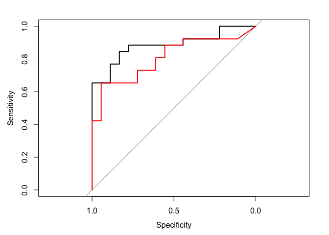

code
================

``` r
suppressPackageStartupMessages(library(tidyverse))
suppressPackageStartupMessages(library(reshape2))
suppressPackageStartupMessages(library(survival))
suppressPackageStartupMessages(library(survminer))
suppressPackageStartupMessages(library(stringr))
suppressPackageStartupMessages(library(ggpubr))
suppressPackageStartupMessages(library(ggridges))
suppressPackageStartupMessages(library(glmnet))
suppressPackageStartupMessages(library(limma))
suppressPackageStartupMessages(library(factoextra))
suppressPackageStartupMessages(library(pheatmap))
suppressPackageStartupMessages(library(randomForest))
suppressPackageStartupMessages(library(fastAdaboost))
suppressPackageStartupMessages(library(pROC))
```

# Data Wrangling:

``` r
cli <- read.csv("~/Desktop/git_docs/Repo_team_Genome-Surfers_W2020/data/raw_data/tcga_paad_clinical.csv", header = T)
toDelete <- seq(0, nrow(cli), 2)
cli <-  cli[-toDelete, ]
cli1 <- cli %>% select(c(submitter_id, age_at_index, 
                         year_of_birth, year_of_death,year_of_diagnosis, 
                         vital_status, race, gender, ajcc_pathologic_m, 
                         ajcc_pathologic_n, 
                         ajcc_pathologic_t, ajcc_pathologic_stage,
                         treatment_or_therapy))
cli1 <- na.omit(cli1)

load("~/Desktop/git_docs/Repo_team_Genome-Surfers_W2020/data/raw_data/tcga_paad.RData")

names(tcga) <- substr(names(tcga), 1, 12)
t <- as.data.frame(t(as.matrix(tcga)))
tcga1 <- tibble::rownames_to_column(t, "submitter_id")


#dat <- right_join(x = tcga1, y = cli1, by = "submitter_id")

cli1$year_of_death <- as.numeric(levels(cli1$year_of_death)[cli1$year_of_death])
```

    ## Warning: NAs introduced by coercion

``` r
cli1$year_of_diagnosis <-as.numeric(levels(cli1$year_of_diagnosis)[cli1$year_of_diagnosis])
```

    ## Warning: NAs introduced by coercion

``` r
cli1$year_of_death[is.na(cli1$year_of_death)] <- 2014
cli1$sur_time <- cli1$year_of_death-cli1$year_of_diagnosis

temp <- data.frame(cbind(as.character(cli$submitter_id), as.character(cli$vital_status)))
names(temp) <- c("submitter_id", "vital_status")
```

# EDA:

\#\#Age distribution across gender

\#\#Age distribution across race

## Gene Expression Visualization

``` r
expressionMatrix <- tcga %>% rownames_to_column("gene") %>% as_tibble()
expressionMatrix <- na.omit(expressionMatrix)

expressionMatrix.nogene <- t(scale(t(expressionMatrix[,-1])))

meltedExpressionMatrix <- expressionMatrix %>% melt(id = "gene") 

transformGeneExpressionMatrix <- function(expressionMatrix) {
  expressionMatrix <- expressionMatrix %>%
    as.data.frame() %>% 
    column_to_rownames("gene") %>%
    t() %>% as.data.frame() %>% 
    rownames_to_column("submitter_id") %>% 
    melt(id = "submitter_id") %>% 
    as_tibble() %>% 
    select(submitter_id,
           gene = variable, 
           expression = value)
  return(expressionMatrix)
}

getExpressionForSamples <- function(sampleIds, expressionMatrix) {
  # use gene column as row name
  dataFrame <- expressionMatrix %>% 
    as.data.frame() %>% 
    column_to_rownames("gene")
  return(dataFrame[sampleIds])
}

expressionDataForGene <- transformGeneExpressionMatrix(expressionMatrix)
expressionDataForGene
```

    ## # A tibble: 7,802,868 x 3
    ##    submitter_id gene   expression
    ##    <chr>        <fct>       <dbl>
    ##  1 TCGA-OE-A75W TSPAN6      0.588
    ##  2 TCGA-2J-AABT TSPAN6      0.439
    ##  3 TCGA-IB-7886 TSPAN6      0.875
    ##  4 TCGA-IB-AAUU TSPAN6      0.552
    ##  5 TCGA-2J-AAB6 TSPAN6      0.571
    ##  6 TCGA-LB-A8F3 TSPAN6      0.798
    ##  7 TCGA-HZ-A4BH TSPAN6      0.763
    ##  8 TCGA-IB-7646 TSPAN6      0.917
    ##  9 TCGA-YB-A89D TSPAN6      0.609
    ## 10 TCGA-Z5-AAPL TSPAN6      0.442
    ## # … with 7,802,858 more rows

``` r
expressionDataForGene <- expressionDataForGene %>% left_join(cli1, by = "submitter_id")
```

    ## Warning: Column `submitter_id` joining character vector and factor, coercing
    ## into character vector

``` r
DesMat <- model.matrix(~ vital_status, cli1)
dsFit <- lmFit(expressionMatrix.nogene, DesMat)
ebfit <- eBayes(dsFit)
toptab <- topTable(ebfit)
```

    ## Removing intercept from test coefficients

``` r
important.genes <- expressionMatrix[as.numeric(rownames(toptab)),1]

important.genes.exp <-  tcga1 %>% select(c(submitter_id, important.genes$gene))

meta.with.imp.gene <- right_join(cli1, important.genes.exp, by = "submitter_id")
```

    ## Warning: Column `submitter_id` joining factor and character vector, coercing
    ## into character vector

``` r
#heat map of important genes to show correlation
sampleDists <- as.dist(1-cor(important.genes.exp[,-1]))
sampleDistMatrix <- as.matrix(sampleDists)
dist.rowname <- rownames(sampleDistMatrix)
pheatmap(sampleDistMatrix,cluster_rows = T)
```

<!-- -->

``` r
#deleted the less important (based on toptable) of 
# the high correlation pairs, ref level is the most imp gene


# CTGF, OLFML2B, CTD-2033D15.2, CYP1B1, KCNE4 deleted.
meta.with.imp.gene.final <- meta.with.imp.gene %>% 
  select(-c("CTGF", "OLFML2B", "CTD-2033D15.2", "CYP1B1", "KCNE4"))
```

# Lasso Selection

``` r
meta.with.imp.gene.final <- na.omit(meta.with.imp.gene.final)
meta.with.imp.gene.final$age_at_index <- as.numeric(meta.with.imp.gene.final$age_at_index)
colnames(meta.with.imp.gene.final)[colnames(meta.with.imp.gene.final) == "RP11-21L23.2"] = "RP11"
smp_size <- floor(0.75 * nrow(meta.with.imp.gene.final))

set.seed(400)
train_ind <- sample(seq_len(nrow(meta.with.imp.gene.final)), size = smp_size)

train <- meta.with.imp.gene.final[train_ind, ]
test <- meta.with.imp.gene.final[-train_ind, ]

yvar <- train$vital_status
temp2 <- train[, - which(names(meta.with.imp.gene.final) %in% c("vital_status", "submitter_id", "year_of_birth", "year_of_death"))]
xvars <- model.matrix(yvar ~ ., data = temp2)

cv.lasso.reg <- cv.glmnet(xvars, yvar, alpha = 1, nfolds = 3, 
                          family = "binomial", measure = "mse", 
                          standardize = T)
best.lam <- cv.lasso.reg$lambda.min
best.lam
```

    ## [1] 0.02809165

``` r
coef(cv.lasso.reg, s = best.lam)
```

    ## 34 x 1 sparse Matrix of class "dgCMatrix"
    ##                                              1
    ## (Intercept)                       1.382392e+03
    ## (Intercept)                       .           
    ## age_at_index                      1.990851e-02
    ## year_of_diagnosis                -6.873713e-01
    ## raceblack or african american     .           
    ## racenot reported                  .           
    ## racewhite                        -1.966931e-01
    ## gendermale                       -4.783423e-01
    ## ajcc_pathologic_mM1               2.346579e-02
    ## ajcc_pathologic_mMX               .           
    ## ajcc_pathologic_nN0               .           
    ## ajcc_pathologic_nN1               .           
    ## ajcc_pathologic_nN1b              .           
    ## ajcc_pathologic_nNX               3.650374e-01
    ## ajcc_pathologic_tT1               .           
    ## ajcc_pathologic_tT2               .           
    ## ajcc_pathologic_tT3               1.696760e-01
    ## ajcc_pathologic_tT4               .           
    ## ajcc_pathologic_tTX               .           
    ## ajcc_pathologic_stageStage I      .           
    ## ajcc_pathologic_stageStage IA     .           
    ## ajcc_pathologic_stageStage IB     .           
    ## ajcc_pathologic_stageStage IIA    .           
    ## ajcc_pathologic_stageStage IIB    5.006946e-01
    ## ajcc_pathologic_stageStage III    .           
    ## ajcc_pathologic_stageStage IV     2.604733e-03
    ## treatment_or_therapynot reported  7.722387e-01
    ## treatment_or_therapyyes          -3.152969e-01
    ## sur_time                         -8.018183e-01
    ## THBS1                             9.536650e-02
    ## NNMT                              .           
    ## CREM                             -3.447826e+00
    ## ITPRIP                            .           
    ## RP11                              3.633714e+00

``` r
plot(cv.lasso.reg)
```

<!-- -->

``` r
lasso.reg <- glmnet(xvars, factor(yvar), alpha = 1, family = 
                      "binomial", standardize = T)  
plot(lasso.reg, xvar = "lambda", label = T)
```

<!-- -->

# Classification of Vital Status

``` r
set.seed(400)
train <- subset(train, select = -c(submitter_id, NNMT, ITPRIP))
test <- subset(test, select = -c(submitter_id,NNMT, ITPRIP))
model1 <- randomForest(vital_status ~ ., data = train, importance = TRUE)
model1
```

    ## 
    ## Call:
    ##  randomForest(formula = vital_status ~ ., data = train, importance = TRUE) 
    ##                Type of random forest: classification
    ##                      Number of trees: 500
    ## No. of variables tried at each split: 3
    ## 
    ##         OOB estimate of  error rate: 29.55%
    ## Confusion matrix:
    ##       Alive Dead class.error
    ## Alive    42   24   0.3636364
    ## Dead     15   51   0.2272727

``` r
# Predicting on train set
predTrain <- predict(model1, train, type = "class")
# Checking classification accuracy
table(predTrain, train$vital_status) 
```

    ##          
    ## predTrain Alive Dead
    ##     Alive    66    0
    ##     Dead      0   66

``` r
predValid <- predict(model1, test, type = "class")
# Checking classification accuracy
mean(predValid == test$vital_status)                    
```

    ## [1] 0.7045455

``` r
table(predValid,test$vital_status)
```

    ##          
    ## predValid Alive Dead
    ##     Alive     8    3
    ##     Dead     10   23

``` r
# To check important variables
importance(model1)      
```

    ##                            Alive       Dead MeanDecreaseAccuracy
    ## age_at_index           4.1358396 -3.7280747           1.09346266
    ## year_of_birth          3.4532631 -4.3687326           0.04193846
    ## year_of_death         23.0988862 17.6391461          22.90344761
    ## year_of_diagnosis      3.3025931  2.5652024           4.10380214
    ## race                   0.5898676 -0.7089703           0.03096113
    ## gender                 3.9723769  5.9297868           6.54130903
    ## ajcc_pathologic_m     -0.6642145 -0.8343337          -1.15040201
    ## ajcc_pathologic_n      2.3974668  0.9705940           2.63333861
    ## ajcc_pathologic_t      2.3443803  4.8715032           4.48253061
    ## ajcc_pathologic_stage  2.0861379  3.9676739           4.01091448
    ## treatment_or_therapy   4.3612540 -1.9089297           2.26132112
    ## sur_time              11.7379277  6.4484777          11.87163785
    ## THBS1                  4.1694151  4.3488726           5.42324432
    ## CREM                  -0.3088039  0.2011058          -0.27375937
    ## RP11                   5.6048993  4.6435825           7.08969631
    ##                       MeanDecreaseGini
    ## age_at_index                 3.4443626
    ## year_of_birth               17.3117862
    ## year_of_death               12.7051276
    ## year_of_diagnosis            2.1475119
    ## race                         0.8294874
    ## gender                       1.6123728
    ## ajcc_pathologic_m            0.9764212
    ## ajcc_pathologic_n            1.1815290
    ## ajcc_pathologic_t            1.3616771
    ## ajcc_pathologic_stage        2.8033933
    ## treatment_or_therapy         1.6662583
    ## sur_time                     5.6410485
    ## THBS1                        3.9735738
    ## CREM                         4.0579560
    ## RP11                         5.4551117

``` r
varImpPlot(model1)
```

<!-- -->

``` r
#Adaboost
ada <- adaboost(vital_status ~., data =  train, 10, tree_depth = 5, n_rounds = 200, verbose = TRUE)
pred <- predict(ada,newdata=test)
print(pred$error)
```

    ## [1] 0.2727273

``` r
print(table(pred$class,test$vital_status))
```

    ##        
    ##         Alive Dead
    ##   Alive    14    8
    ##   Dead      4   18

``` r
predValid1 <- predict(model1, test, type = "prob")
rf.roc<-roc(test$vital_status,predValid1[,2])
```

    ## Setting levels: control = Alive, case = Dead

    ## Setting direction: controls < cases

``` r
ada.roc<-roc(test$vital_status,pred$votes[,2])
```

    ## Setting levels: control = Alive, case = Dead
    ## Setting direction: controls < cases

``` r
plot(rf.roc)
lines(ada.roc, col = "red")
```

<!-- -->

``` r
auc(rf.roc)
```

    ## Area under the curve: 0.8825

``` r
auc(ada.roc)
```

    ## Area under the curve: 0.8194

# Classification of Gene Expressions

## Data set

``` r
# top 10 genes
selectGene <- tcga1 %>% 
  select(c(submitter_id, important.genes$gene))

temp1 <- as.data.frame(selectGene %>% 
  melt(id = "submitter_id",
       var = "gene"))

temp2 <- left_join(temp1, cli) 
```

    ## Joining, by = "submitter_id"

    ## Warning: Column `submitter_id` joining character vector and factor, coercing
    ## into character vector

``` r
first10 <- temp2 %>% 
  pivot_wider(names_from = "gene",
              values_from = "value")


# the first 2 expressed genes
selectGene <- tcga1 %>% 
  select(c(submitter_id, c(important.genes$gene[1], important.genes$gene[2])))

temp4 <- as.data.frame(selectGene %>% 
  melt(id = "submitter_id",
       var = "gene"))

temp5 <- left_join(temp4, cli1) 
```

    ## Joining, by = "submitter_id"

    ## Warning: Column `submitter_id` joining character vector and factor, coercing
    ## into character vector

``` r
first2 <- temp5 %>% 
  pivot_wider(names_from = "gene",
              values_from = "value") 

dim(first2)
```

    ## [1] 177  16

``` r
temp6 <- first2[,c(14,15)]
# Dendogram
dist.euclidean <- dist(temp6, method = "euclidean")
p <- hclust(dist.euclidean, method = "single")
plot(p, xlim = 50)
rect.hclust(p, k =5)
```

<!-- -->

``` r
highlight_df <- first2[c(52,55,127,135),]
highlight_df <- highlight_df %>% select("submitter_id", "THBS1", "NNMT", "vital_status")

# ggplot first 2 gene samples
first2 %>% 
  select("submitter_id", "THBS1", "NNMT", "vital_status") %>% 
  ggplot(aes(x = THBS1, y = NNMT, color = vital_status)) +
  geom_point() +
  geom_point(data = highlight_df, aes(x = THBS1, y = NNMT), size = 10) +
  theme_bw()
```

<!-- -->

``` r
first10 %>% 
  select("submitter_id", "CREM", "THBS1", "vital_status") %>% 
  ggplot(aes(x = CREM, y = THBS1, color = vital_status)) +
  geom_point() +
  theme_bw()
```

<!-- -->

# PCA

``` r
res.pca1 <- prcomp(first10[,162:171], scale = T)
fviz_eig(res.pca1,addlabels = TRUE)
```

<!-- -->

``` r
var <- get_pca_var(res.pca1)

set.seed(123)
res.km <- kmeans(var$coord, centers = 2, nstart = 25)
grp <- as.factor(res.km$cluster)
# Color variables by groups
fviz_pca_var(res.pca1, col.var = grp, 
             palette = c("#0073C2FF", "#EFC000FF"),
             legend.title = "Cluster",
             title = "")
```

<!-- -->

``` r
fviz_pca_ind(res.pca1,
             geom.ind = "point", # show points only (nbut not "text")
             col.ind = factor(first10$ajcc_pathologic_stage), # color by groups
             palette = c("#0073C2FF", "#EFC000FF", "green", "blue",
                         "lightblue", "red", "grey", "black"),
             addEllipses = TRUE, # Concentration ellipses
             legend.title = "8 ajcc pathologic stages",
             alpha.ind = 0.7,
             title = ""
             )
```

<!-- -->

``` r
fviz_pca_ind(res.pca1,
             geom.ind = "point", # show points only (nbut not "text")
             col.ind = factor(first10$vital_status), # color by groups
             palette = c("#0073C2FF","green"),
             addEllipses = TRUE, # Concentration ellipses
             legend.title = "vital status",
             alpha.ind = 0.7,
             title = ""
             )
```

<!-- -->

# compare the alive and dead based on average top10 gene expresion

``` r
first10$count <- scale(rowMeans(first10[,162:171]))


first10 %>% 
  ggplot(aes(x = vital_status, y = count)) +
  geom_violin(width = 0.3) +
  theme_bw()
```

<!-- -->

``` r
# two sample t-test
t.test(first10[first10$vital_status == "Alive", ]$count, first10[first10$vital_status == "Dead", ]$count)
```

    ## 
    ##  Welch Two Sample t-test
    ## 
    ## data:  first10[first10$vital_status == "Alive", ]$count and first10[first10$vital_status == "Dead", ]$count
    ## t = -0.29897, df = 164.9, p-value = 0.7653
    ## alternative hypothesis: true difference in means is not equal to 0
    ## 95 percent confidence interval:
    ##  -0.3452312  0.2544316
    ## sample estimates:
    ##   mean of x   mean of y 
    ## -0.02359762  0.02180215

``` r
sample_to_choose <- sample(1:length(unique(first10$submitter_id)), size = 100)
names_to_choose <- as.character(unique(first10$submitter_id)[sample_to_choose])

temp10 <- first10 %>% 
    filter(submitter_id %in% names_to_choose) %>% 
    group_by(submitter_id) 

temp10 %>% 
  ggplot(aes(x = as.factor(submitter_id), y = count, color = vital_status)) + 
  geom_point() +
  theme_bw() +
  theme(axis.text.x = element_text(angle = 90, hjust = 1))
```

<!-- -->

# Survival Analysis

\#\#Kalpan-Meier estimator We first use Kalpan-Meier plot to summarize
the survival experience of the event-time porcess. `sur_time` variable
is the duration from year of diagnosis to
death.

``` r
sur_dat <- as.data.frame(cbind(cli1$sur_time, cli1$vital_status, cli1$treatment_or_therapy))
colnames(sur_dat) <- c("sur_time", "vital_status", "treatment_or_therapy")
with(cli1, Surv(sur_time, vital_status))
```

    ##   [1]  0:Dead  3+      0:Dead  5+      0:Dead  1+      1+      1+      0:Dead
    ##  [10]  1+      2+      6+      1+      1+      1:Dead  2+      0:Dead  1+    
    ##  [19]  2:Dead  3+      1+      1:Dead  3:Dead  1:Dead  4+      1:Dead  1:Dead
    ##  [28]  1+      3:Dead  2+      4+      2:Dead  1+      1+      2+      1:Dead
    ##  [37]  2:Dead  0:Dead  0:Dead  4:Dead  0:Dead  0:Dead  1+      3+      1+    
    ##  [46]  1:Dead  2+      0:Dead  5+      0:Dead  0:Dead  3+      0:Dead  0:Dead
    ##  [55]  1+      3:Dead  4+      2+      6+      1:Dead  4+      2+      0:Dead
    ##  [64]  2:Dead  3+      2+      1:Dead  6+      2+      1:Dead  3+      2:Dead
    ##  [73]  2:Dead  2+      1:Dead  1:Dead  3+      1:Dead  1:Dead  1+      2+    
    ##  [82]  3+      3+      1:Dead  0:Dead  1:Dead  1:Dead  1+      1:Dead  1+    
    ##  [91]  0:Dead  3+      2:Dead  2+      5+      2+      0:Dead  1:Dead  1:Dead
    ## [100]  2:Dead  1:Dead  0:Dead  3:Dead  1+      1:Dead  1:Dead  1:Dead  4:Dead
    ## [109]  3+      0:Dead  0:Dead  3+     NA+     13:Dead  5+      5+      1+    
    ## [118]  1+      3+      1+      3:Dead  2+      2+      3:Dead  1:Dead  0:Dead
    ## [127]  2+      1:Dead  2:Dead  2+      2:Dead  0:Dead  2+      1:Dead  1+    
    ## [136]  1+      1:Dead  7+      0:Dead  2+      3+      2:Dead  3:Dead  2:Dead
    ## [145]  2:Dead  1:Dead  4+      2+      3+      3:Dead  2:Dead  1:Dead  1+    
    ## [154]  1:Dead  1+      5:Dead  1+      2+      2+      2+      0:Dead  0:Dead
    ## [163]  2+      1:Dead  3:Dead  2:Dead  3+      0:Dead  2:Dead  1+      6+    
    ## [172]  1:Dead  3:Dead  2+      1+      3:Dead  0:Dead

``` r
fit1 <- survfit(Surv(sur_time, vital_status) ~ treatment_or_therapy, data = sur_dat)
summary(fit1)
```

    ## Call: survfit(formula = Surv(sur_time, vital_status) ~ treatment_or_therapy, 
    ##     data = sur_dat)
    ## 
    ## 1 observation deleted due to missingness 
    ##                 treatment_or_therapy=1 
    ##  time n.risk n.event survival std.err lower 95% CI upper 95% CI
    ##     0     76      21    0.724  0.0513        0.630        0.832
    ##     1     55      15    0.526  0.0573        0.425        0.651
    ##     2     30       5    0.439  0.0597        0.336        0.573
    ##     3     19       3    0.369  0.0622        0.265        0.514
    ##    13      1       1    0.000     NaN           NA           NA
    ## 
    ##                 treatment_or_therapy=2 
    ##  time n.risk n.event survival std.err lower 95% CI upper 95% CI
    ##     1     11       2    0.818   0.116        0.619        1.000
    ##     2      6       1    0.682   0.158        0.433        1.000
    ##     3      5       2    0.409   0.177        0.175        0.955
    ##     5      1       1    0.000     NaN           NA           NA
    ## 
    ##                 treatment_or_therapy=3 
    ##  time n.risk n.event survival std.err lower 95% CI upper 95% CI
    ##     0     89       7    0.921  0.0285        0.867        0.979
    ##     1     82      16    0.742  0.0464        0.656        0.838
    ##     2     51      10    0.596  0.0556        0.497        0.716
    ##     3     22       6    0.434  0.0696        0.317        0.594
    ##     4      8       2    0.325  0.0844        0.195        0.541

``` r
ggsurvplot(
  fit1, 
  data =sur_dat , 
  size = 1,                 # change line size
  palette = 
    c("#E7B800", "#2E9FDF", "green"),# custom color palettes
  conf.int = TRUE,          # Add confidence interval
  pval = TRUE,              # Add p-value
  ggtheme = theme_bw()    
)
```

<!-- -->

``` r
fit.coxph <- coxph(Surv(sur_time, vital_status) ~ treatment_or_therapy, 
                   data = sur_dat)

ggforest(fit.coxph, data = sur_dat)
```

<!-- -->

## Log rank test

``` r
survdiff(Surv(sur_time, vital_status) ~ treatment_or_therapy, 
                   data = sur_dat)
```

    ## Call:
    ## survdiff(formula = Surv(sur_time, vital_status) ~ treatment_or_therapy, 
    ##     data = sur_dat)
    ## 
    ## n=176, 1 observation deleted due to missingness.
    ## 
    ##                         N Observed Expected (O-E)^2/E (O-E)^2/V
    ## treatment_or_therapy=1 76       45    36.97    1.7452    3.6620
    ## treatment_or_therapy=2 11        6     6.69    0.0712    0.0951
    ## treatment_or_therapy=3 89       41    48.34    1.1150    2.9390
    ## 
    ##  Chisq= 3.7  on 2 degrees of freedom, p= 0.2

``` r
#p=0.2 no difference in survival
```
