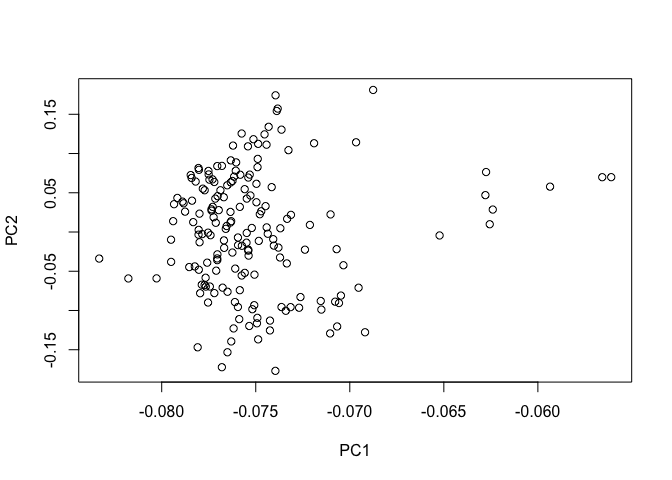

exploratory\_analysis
================
Hassan Ali
09/03/2020

``` r
#PCA for top 5000 most variable genes

tcga_z <- scale(tcga)
tcga_var <- as.matrix(as.data.frame(apply(tcga, 1, var)))
tcga_var_sorted <- tcga_var[order(tcga_var, decreasing = TRUE), , drop = FALSE] 
tcga_var_top5000 <- as.matrix(as.data.frame(tcga_var_sorted[1:5000,]))
tcga_filt <- tcga_z[rownames(tcga_z) %in% rownames(tcga_var_top5000),]
A <- cov(tcga_filt, method = "pearson")
E <- eigen(A)
FV <- data.frame(as.matrix(E$vectors[, 1:2]), stringsAsFactors = F)
colnames(FV) <- c("PC1", "PC2")
rownames(FV) <- colnames(tcga_filt)
plot(FV[, 1:2])
```

<!-- -->
