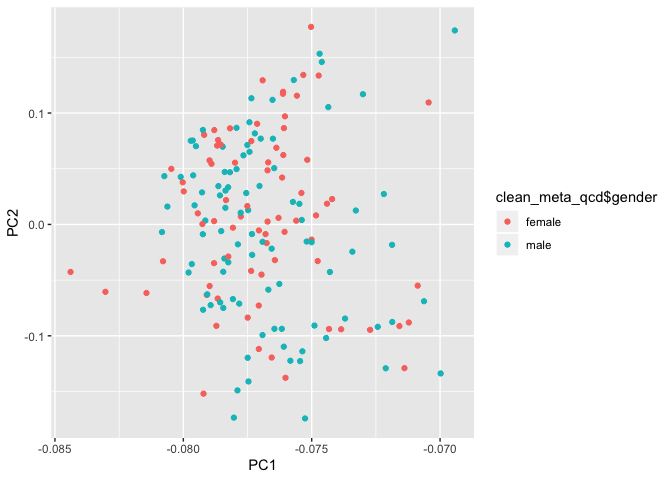

exploratory\_analysis
================

*PCA of top 5000 most variable genes*

``` r
#PCA for top 5000 most variable genes

tcga_z <- scale(tcga)
tcga_var <- as.matrix(as.data.frame(apply(tcga, 1, var)))
tcga_var_sorted <- tcga_var[order(tcga_var, decreasing = TRUE), , drop = FALSE] 
tcga_var_top5000 <- as.matrix(as.data.frame(tcga_var_sorted[1:5000,]))
tcga_filt <- tcga_z[rownames(tcga_z) %in% rownames(tcga_var_top5000),]
A <- cov(tcga_filt, method = "pearson")
E <- eigen(A)
FV <- data.frame(as.matrix(E$vectors[, 1:2]), stringsAsFactors = F)
colnames(FV) <- c("PC1", "PC2")
rownames(FV) <- colnames(tcga_filt)
plot(FV[, 1:2])
```

<!-- -->
*Cleaning the Dataset*

``` r
#Order by PC1
FV_sorted <- FV[order(-FV$PC1),]

#identify 8 outlier samples
outlier_samples <- rownames(FV_sorted[1:8,])

#Remove 8 outlier samples
tcga_z_qcd <- tcga_z[, !(colnames(tcga_z) %in% outlier_samples)]
tcga_qcd <- tcga[, !(colnames(tcga) %in% outlier_samples)]

#PCA of filtered dataset
tcga_filt <- tcga_z_qcd[rownames(tcga_z_qcd) %in% rownames(tcga_var_top5000),]
A <- cov(tcga_filt, method = "pearson")
E <- eigen(A)
FV <- data.frame(as.matrix(E$vectors[, 1:2]), stringsAsFactors = F)
colnames(FV) <- c("PC1", "PC2")
rownames(FV) <- colnames(tcga_z_qcd)

#Make Sample ID's Comparable
outlier_samples <- substring(outlier_samples, 1, 12)
clean_meta_qcd <- clean_meta[!(clean_meta$submitter_id %in% outlier_samples), ]
rownames(FV) <- substring(rownames(FV),1,12)
```

*PCA Plots*

``` r
#grouped by race
ggplot(FV, aes(x=PC1, y=PC2)) + 
  geom_point(aes(color=clean_meta_qcd$race))
```

<!-- -->

``` r
#grouped by vital status
ggplot(FV, aes(x=PC1, y=PC2)) + 
  geom_point(aes(color=clean_meta_qcd$vital_status))
```

<!-- -->

``` r
#grouped by gender
ggplot(FV, aes(x=PC1, y=PC2)) + 
  geom_point(aes(color=clean_meta_qcd$gender))
```

<!-- -->

``` r
#grouped by pathologic stage
ggplot(FV, aes(x=PC1, y=PC2)) + 
  geom_point(aes(color=clean_meta_qcd$vital_status)) +
  facet_wrap(~clean_meta_qcd$ajcc_pathologic_stage)
```

<!-- -->
*Heatmap*

``` r
x <-clean_meta_qcd[,-1]
rownames(x) <- clean_meta_qcd$submitter_id

DesMat <- model.matrix(~ vital_status, x)
dsFit <- lmFit(tcga_z_qcd, DesMat)
ebfit <- eBayes(dsFit)
toptab <- topTable(ebfit)
```

    ## Removing intercept from test coefficients

``` r
tcga_z_qcd_filt <- tcga_z_qcd[rownames(tcga_z_qcd) %in% rownames(toptab),]
colnames(tcga_z_qcd_filt) <- substring(colnames(tcga_z_qcd_filt),1,12)


var1 = c("orange1", "green")
names(var1) = levels(x$vital_status)

var2 = c("blue", "red")
names(var2) = levels(x$gender)

covar_color <- list(vital_status = var1, gender = var2)


pheatmap(tcga_z_qcd_filt, cluster_rows = TRUE,cluster_cols = TRUE, clustering_method = "ward.D2", 
         clustering_distance_cols = "euclidean", show_rownames = TRUE,show_colnames = FALSE, 
         main = "Clustering heatmap for top 10 genes", annotation = x[, c("vital_status", "gender")], 
         annotation_colors = covar_color)
```

<!-- -->
